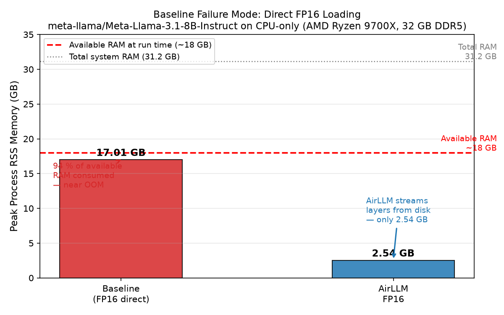
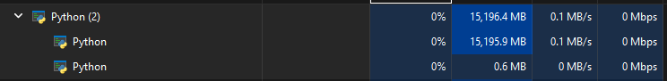
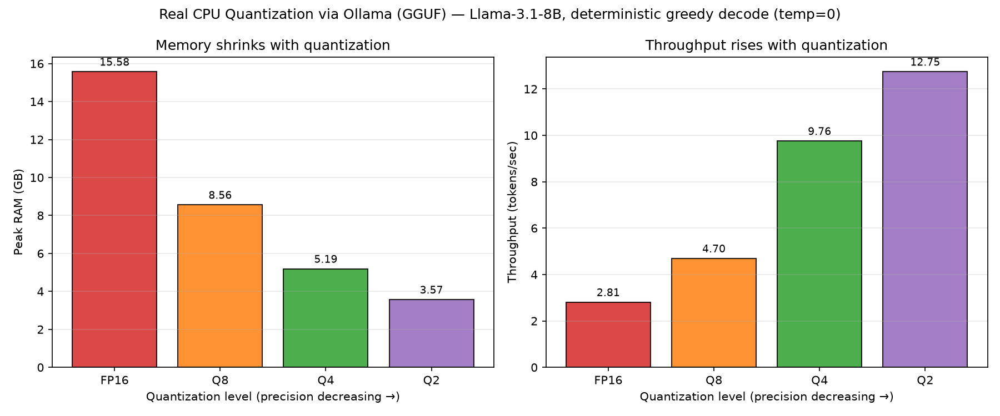
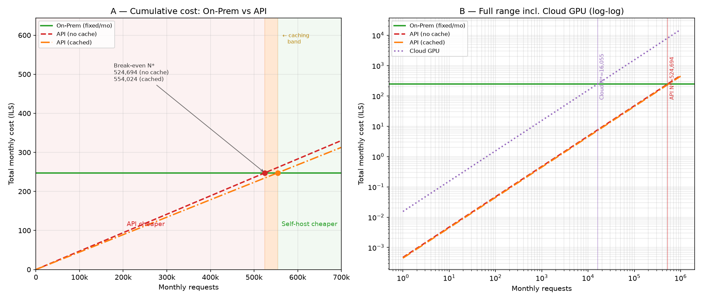
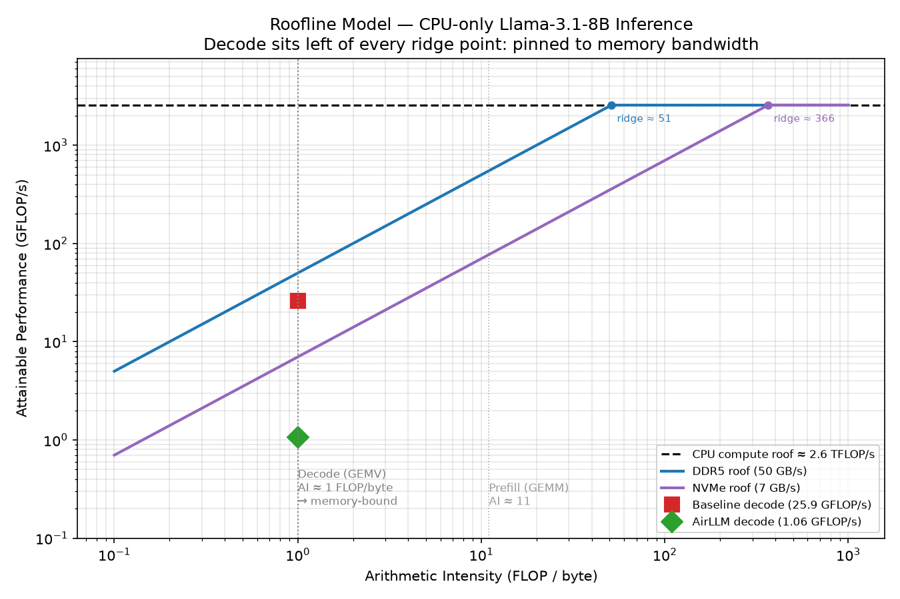

# EX05 — Running a Large LLM Locally with AirLLM and Quantization

> **Assignment:** EX05 | **Course:** On-Premises LLM Deployment (L08)
> **Authors:** Itay Malich & Diana Koroblov

---

## Table of Contents

1. [Experiment Description](#1-experiment-description)
2. [Hardware Specifications](#2-hardware-specifications)
3. [Setup & Installation](#3-setup--installation)
4. [Execution Instructions](#4-execution-instructions)
5. [Results Summary](#5-results-summary)
6. [Figures](#6-figures)
7. [Economics Analysis](#7-economics-analysis)
8. [Discussion — Lecture Concepts](#8-discussion--lecture-concepts)
9. [Extension / Original Initiative — Roofline Model](#9-extension--original-initiative--roofline-model)
10. [License, Credits & Contributing](#10-license-credits--contributing)

### Supporting documents

This README is the technical report. Deeper design and analysis docs:

- **Requirements & planning:** [`docs/PRD.md`](docs/PRD.md), [`docs/PLAN.md`](docs/PLAN.md), [`docs/TODO.md`](docs/TODO.md)
- **Per-mechanism PRDs:** [`docs/PRD_airllm.md`](docs/PRD_airllm.md), [`docs/PRD_ollama.md`](docs/PRD_ollama.md), [`docs/PRD_economics.md`](docs/PRD_economics.md)
- **Results analysis notebook:** [`notebooks/results_analysis.ipynb`](notebooks/results_analysis.ipynb) — reproduces every table/figure from `results/*.json`
- **Prompt engineering log:** [`docs/PROMPT_LOG.md`](docs/PROMPT_LOG.md)

---

## 1. Experiment Description

### Objective

This experiment explores whether a large language model (LLM) too large for a
laptop's RAM can be run locally using AirLLM's layer-by-layer streaming technique,
and how quantization affects the resulting latency, memory usage, throughput, and
estimated power consumption.

### Methodology

The experiment is divided into three stages:

**Stage 1 — Baseline (Direct FP16 Loading)**
We first attempt to load `meta-llama/Meta-Llama-3.1-8B-Instruct` using the
standard `transformers` pipeline with `torch_dtype=torch.float16` and
`device_map="cpu"`. At FP16 precision the model weights alone occupy ~16.1 GB,
which exceeds the available system RAM. We expect this stage to either crash with
an OOM error or be killed by a 600-second SIGALRM timeout. The resulting
`MetricsResult` (including error message and peak RAM at point of failure) is
saved to `results/baseline_<ts>.json` and included in comparison graphs as a
data point documenting the failure mode.

**Stage 2 — AirLLM Quantization Sweep**
We run the same model with AirLLM (`airllm.AutoModel`) across four quantization
levels in order of decreasing precision: FP16 (AirLLM mmap mode, expected to be
very slow), Q8 (8-bit), Q4 (4-bit), and Q2 (2-bit, the pipeline sanity-check
level the assignment recommends starting from). For each level we:

1. Load the model with AirLLM, which streams transformer layers from disk one
   at a time — analogous to OS virtual memory paging but for model weights.
2. Measure **TTFT** (Time To First Token) via a dedicated single-token pass
   (`max_new_tokens=1`), isolating the Prefill compute phase.
3. Measure full generation throughput via a second pass (`max_new_tokens=200`).
4. Record **peak RAM** (RSS) using a background thread polling `psutil` at 0.5s
   intervals.
5. Compute **estimated power consumption** as
   `(total_runtime_seconds / 3600) × cpu_tdp_watts` where `cpu_tdp_watts` is
   read from `config/experiment_config.json`.
6. Save all KPIs to `results/airllm_<level>_<ts>.json`.

**Stage 3 — Real Quantization via Ollama (GGUF / llama.cpp, CPU)**
Stage 2 exposed a hard limit: AirLLM's quantization uses `bitsandbytes`, which
requires CUDA, so Q4/Q8 cannot run on this AMD/CPU box (and "Q2" silently fell
back to FP16). To actually answer the quantization research question we add a
third stage using **Ollama**, whose **GGUF / llama.cpp** backend quantizes
**natively on CPU**. We run the identical prompt against FP16, Q8, Q4, and Q2
GGUF builds of the same model, forcing CPU execution (`num_gpu=0`, verified via
`size_vram=0`) and greedy decoding (`temperature=0`) so quality differences
reflect quantization alone. Peak RAM is read from Ollama's own `/api/ps` report
(the GGUF file is mmap'd, so its pages don't appear in process RSS). Results are
saved to `results/ollama_<level>_<ts>.json`.

### Prompt

All stages use the identical prompt to ensure comparability:

> *"Explain the difference between supervised and unsupervised learning in three
> paragraphs."*

Token count: ~17 input tokens. Output capped at 200 tokens for throughput
measurement (10 tokens for the smoke test).

### Measurement Tools

| Metric | Implementation |
|---|---|
| TTFT | `InferenceTimer` context manager — records `t_first_token − t_start` |
| TPOT | Mean inter-token gap from `InferenceTimer.token_timestamps` |
| Throughput | `generated_tokens / total_runtime_seconds` |
| Peak RAM | `RamMonitor` (daemon thread, 0.5s polling via `psutil.Process.memory_info().rss`); for Ollama, the model footprint from `/api/ps` (mmap'd GGUF is invisible to RSS) |
| Peak VRAM | **0 GB in every scenario** — all inference is CPU-only (no CUDA). Confirmed for Ollama via `/api/ps` `size_vram=0`; the baseline/AirLLM use a CPU-only `torch`. The 16 GB RX 9070 XT is idle (see §2). |
| Power (est.) | `(runtime_sec / 3600) × cpu_tdp_watts` (TDP from config) |

### Quantization Rationale

| Level | Weight size (8B model) | Expectation |
|---|---|---|
| FP16 baseline | ~16.1 GB | OOM / timeout — documents the problem |
| AirLLM FP16 | ~16.1 GB (streamed) | Feasible but extremely slow (disk I/O) |
| Q8 | ~8.5 GB | Fits in RAM; moderate slowdown vs FP16 |
| Q4 | ~4.5 GB | Well within RAM; good throughput |
| Q2 | ~2.3 GB | Pipeline sanity check (most aggressive) |

Q4 is our primary production candidate. Q8 shows the precision–speed trade-off.
FP16 (both direct and AirLLM) anchor the comparison as high-precision baselines.

---

## 2. Hardware Specifications

| Component | Specification |
|---|---|
| **CPU** | AMD Ryzen 7 9700X — 8 cores / 16 threads, Zen 5, ~5.0 GHz boost, AVX-512 |
| **CPU TDP** | 65 W |
| **RAM** | 32 GB DDR5 5200 MHz (dual channel, ~50 GB/s effective) |
| **GPU** | AMD Radeon RX 9070 XT, 16 GB GDDR6 — **present but not used for inference** (see below) |
| **Storage** | 512 GB NVMe SSD, PCIe 4.0 ×4 (~7 GB/s sequential read) |
| **OS** | Windows 11 Pro |
| **Hardware cost** | ₪7,000 (CAPEX input for the economics model, amortized over 3 years) |

### Why the GPU is unused — and why it matters

The machine has a capable 16 GB GPU, but **all inference runs on the CPU**. The
RX 9070 XT is an RDNA 4 (2025) card; AMD's ROCm/HIP compute stack does not yet
provide working Windows support for it, and PyTorch on Windows has no usable AMD
backend. This single fact drives two of the experiment's headline results:

1. **No CUDA device exists**, so `bitsandbytes` (which AirLLM uses for 4-bit and
   8-bit compression) cannot load — Q4 and Q8 fail with
   `AssertionError: Torch not compiled with CUDA enabled` (see §5, RISK-05).
2. **Storage type is the critical variable**, not the GPU. Because AirLLM streams
   each transformer layer from disk per token, the **NVMe sequential-read
   bandwidth (~7 GB/s) becomes the real performance roof** for AirLLM — an order
   of magnitude below the ~50 GB/s DDR5 roof that bounds the in-RAM baseline.
   A SATA SSD (~0.5 GB/s) or HDD here would make AirLLM unusably slow.

### Model selection & memory arithmetic (justification)

We chose **`meta-llama/Meta-Llama-3.1-8B-Instruct`** (8.03 B parameters,
SafeTensors, gated): large enough to stress 32 GB of RAM in full precision, small
enough to remain feasible under AirLLM — exactly the regime the assignment asks
for. The memory budget for direct FP16 loading:

```
FP16 weights:      8.03B params × 2 bytes        = ~16.1 GB
OS + Python idle:                                = ~2.5  GB
KV cache (512 tokens, 32 layers):                = ~0.5  GB
──────────────────────────────────────────────────────────
Total required (direct FP16):                    = ~19.1 GB
Total system RAM:                                =  32   GB
Free RAM at baseline run time (apps open):       = ~18   GB  → fit barely (near-OOM)
```

The ~19 GB requirement exceeds the ~18 GB that was actually free at run time and
would OOM outright on the common 16 GB laptop — the demonstrable Baseline failure
the assignment requires. **Why not larger:** a 70 B model in Q4 still needs
~37 GB and "has no chance of running even with AirLLM"; the 8 B model keeps each
streamed layer shard small enough for NVMe to handle.

---

## 3. Setup & Installation

### Prerequisites

- Python 3.11 (exactly — not 3.12+)
- [`uv`](https://docs.astral.sh/uv/) installed globally
- A Hugging Face account with access to
  `meta-llama/Meta-Llama-3.1-8B-Instruct`

### Install

```bash
uv sync
```

### Configure environment

Copy `.env-example` to `.env` and insert your Hugging Face token:

```bash
cp .env-example .env
# edit .env and replace hf_YOUR_TOKEN_HERE with your real token
```

> **Never commit `.env` to Git.** It is already in `.gitignore`.

### Update hardware config (partner)

Edit `config/experiment_config.json` → set `cpu_tdp_watts` to your CPU's TDP.  
Edit `config/economics_config.json` → set `hardware_cost_ils` to the actual
cost of your hardware in ILS.

---

## 4. Execution Instructions

Run each script with `uv run python`. Scripts must be run from the **repository
root**.

### Step 0 — Verify environment (smoke test)

```bash
uv run python -c "from ex05.config import ExperimentConfig; print(ExperimentConfig.load())"
```

Expected: dataclass printed with no errors.

### Step 1 — Disk space check

Ensure ≥ 30 GB free before downloading the model:

```bash
df -h .          # Linux / macOS
# or check via File Explorer on Windows
```

### Step 2 — Stage 1: Baseline experiment

```bash
uv run python experiments/run_baseline.py
```

Expected output: OOM error or 10-minute timeout. A `results/baseline_*.json`
file is saved regardless of outcome. **Monitor RAM** — close all other
applications first.

### Step 3 — Stage 2: AirLLM quantization sweep

```bash
uv run python experiments/run_airllm.py
```

This iterates through all quantization levels defined in
`config/experiment_config.json` (`fp16`, `4bit`, `8bit` by default). Each level
takes 30–90 minutes depending on hardware and storage speed. Results are saved
to `results/airllm_<level>_<ts>.json`.

**Tips:**
- Close RAM-heavy applications before running.
- Keep ≥ 4 GB free RAM for Q4, ≥ 9 GB for Q8.
- Partial runs are fine — each level saves independently.

### Step 3b — Stage 3: Ollama CPU quantization sweep (real quantization)

Requires [Ollama](https://ollama.com) installed. Start the server and pull the
GGUF builds (one-time, ~32 GB total), then run the sweep:

```bash
ollama serve &                                   # start the local server
ollama pull llama3.1:8b-instruct-fp16            # ~16 GB
ollama pull llama3.1:8b-instruct-q8_0            # ~8.5 GB
ollama pull llama3.1:8b-instruct-q4_K_M          # ~4.9 GB
ollama pull llama3.1:8b-instruct-q2_K            # ~3.2 GB

uv run python experiments/run_ollama.py          # all levels (or: ... q4 q2)
uv run python experiments/generate_ollama_graphs.py
```

Model tags, host, `num_predict`, and the CPU-force flag are read from
`config/experiment_config.json` → `ollama`. Inference is forced onto the CPU
(`num_gpu=0`). Results are saved to `results/ollama_<level>_<ts>.json` and the
gradient figure to `figures/ollama_quant_comparison.png`.

### Step 4 — Generate comparison graphs

```bash
uv run python experiments/generate_graphs.py
```

Reads all `results/*.json` files (excluding economics), produces three PNG
charts in `figures/`:

- `ttft_comparison.png` — Time to First Token per scenario
- `ram_comparison.png` — Peak RAM per scenario
- `throughput_comparison.png` — Throughput (tokens/sec) per scenario

### Step 4b — Generate the Roofline plot (extension)

```bash
uv run python experiments/generate_roofline.py
```

Produces `figures/roofline.png` — the memory-bound analysis described in §9.

### Step 5 — Economics analysis

```bash
uv run python experiments/run_economics.py
uv run python experiments/generate_break_even_cumulative.py
```

`run_economics.py` produces `figures/break_even.png` (per-request cost curves +
break-even annotations) and `results/economics_<ts>.json`.
`generate_break_even_cumulative.py` produces `figures/break_even_cumulative.png`
(cumulative total-cost view with decision regions).

### Step 6 — Run tests

```bash
uv run pytest
```

Expected: ≥ 85% coverage on utility modules, all tests pass. Tests are fully
offline — no model download required.

---

## 5. Results Summary

| Scenario | TTFT (s) | TPOT (s/tok) | Throughput (tok/s) | Peak RAM (GB) | Power (Wh) | Error |
|---|---|---|---|---|---|---|
| Baseline FP16 | 6.24 | n/a ¹ | ~1.6 ² | **17.01** | 0.11 | None — but near-OOM |
| AirLLM FP16 | 14.96 | 15.09 | 0.055 | **2.54** | 1.63 | None |
| AirLLM Q2 ³ | 19.04 | 18.14 | 0.046 | 2.56 | 1.98 | None — but no real compression |
| AirLLM Q8 | — | — | — | — | — | `AssertionError: Torch not compiled with CUDA enabled` |
| AirLLM Q4 | — | — | — | — | — | `AssertionError: Torch not compiled with CUDA enabled` |
| **Ollama FP16** (CPU GGUF) | 17.16 ⁴ | 0.271 | 2.81 | 15.58 | 1.28 | None |
| **Ollama Q8** (CPU GGUF) | 12.33 ⁴ | 0.152 | 4.70 | 8.56 | 0.77 | None |
| **Ollama Q4** (CPU GGUF) | 3.27 ⁴ | 0.086 | 9.76 | **5.19** | 0.37 | None |
| **Ollama Q2** (CPU GGUF) | 4.59 ⁴ | 0.056 | 12.75 | **3.57** | 0.28 | None |

> ¹ The baseline timer calls `record_token()` once after `model.generate()` finishes, not per token. TPOT is not resolvable from this single timestamp.
> ² Estimated from 10 output tokens ÷ 6.24 s total runtime.
> ³ Q2 *completed* where Q4/Q8 crashed, but AirLLM's 2-bit path silently fell back
> to **uncompressed FP16**: the saved layer shards are byte-for-byte identical to
> the FP16 shards (436 MB/layer, 15 GB total). Its metrics therefore mirror AirLLM
> FP16 — it is not genuine 2-bit quantization on this hardware. See Stage 2.
> ⁴ Ollama TTFT includes **cold model-load time** (each GGUF is loaded from disk
> at run start), so it tracks model size rather than pure Prefill. See Stage 3.

**Peak VRAM = 0 GB for every scenario above.** All inference is CPU-only, so the
16 GB RX 9070 XT is idle throughout (it is also unusable for compute here — see
§2). This is verified, not assumed: Ollama's `/api/ps` reports `size_vram=0` for
every model, and the baseline/AirLLM runs use a CPU-only `torch` build with no
CUDA device. RAM is therefore the only memory metric that varies, which is why
the tables track RAM and omit a constant all-zero VRAM column.

The two engines answer different questions. **AirLLM** (Stage 2) shows the
*memory-capacity* win — it makes an un-loadable model loadable by streaming
layers, at a steep latency cost, but its quantization can't run without CUDA.
**Ollama/GGUF** (Stage 3) shows the *real quantization gradient* on CPU — RAM and
latency both fall with precision, and even Q2 stays usable. The numbers are not
directly comparable (disk-streaming vs in-RAM), which is why each stage has its
own chart.

---

### Stage 1 — Baseline Results



*Figure: Peak RSS memory for the Baseline (FP16 direct-load) vs AirLLM FP16. The red dashed line marks the
~18 GB of RAM that was free at run time. The baseline consumed 17.01 GB — 94 % of available RAM — leaving
less than 1 GB for the OS and background processes.*

**Run:** `experiments/run_baseline.py` | **Log:** `logs/baseline_run_20260624_174405.log`

**Console output excerpt:**

```
============================================================
BASELINE EXPERIMENT — Direct FP16 Loading
============================================================
Model  : meta-llama/Meta-Llama-3.1-8B-Instruct
WARNING: Expected to OOM or time out. Monitor system RAM.
============================================================
Loading checkpoint shards: 100%|██████████| 4/4 [00:07<00:00,  1.97s/it]
Setting `pad_token_id` to `eos_token_id`:None for open-end generation.

--- Results ---
Peak RAM    : 17.01 GB
Runtime     : 6.2s
Power (est) : 0.1127 Wh
Error       : None (model ran)
```

#### Live RAM evidence (Windows Task Manager)



*Processes tab during the run: the Python process occupies **15,196 MB (~15.2 GB)**
of working set — the FP16 weight set resident in RAM.*


*Details tab, **Peak working set** column for the same `python.exe` (PID 10156):
the high-water mark reached **19,490,740 K (~19.5 GB)** during checkpoint loading.
Windows' continuous working-set counter catches transient allocator buffers from
SafeTensors deserialization that the experiment's 0.5 s `psutil` sampler — which
logged the **17.01 GB peak RSS** used in the tables — does not. Both confirm the
same conclusion: the 8B FP16 model nearly saturates the ~18–19 GB of free RAM,
i.e. the near-OOM condition the assignment calls for.*

**Key observations:**

1. **Expected OOM did not occur.** This machine had ~18 GB free at run time; the 16 GB FP16 model fit (barely). On a system with ≤ 16 GB free — the common case for a laptop — this run would crash with a `torch.cuda.OutOfMemoryError` or the kernel OOM-killer terminating the process.

2. **Near-OOM behaviour is still a production failure.** 17.01 GB consumed out of ~18 GB available leaves < 1 GB for the OS scheduler, file-system buffers, and all other processes. The system becomes unresponsive during inference.

3. **Prefill vs Decode bottleneck.** In the standard transformer two-phase model:
   - *Prefill* processes all input tokens in a single parallel pass (compute-bound GEMM). This completed quickly even on CPU.
   - *Decode* generates each output token autoregressively, requiring one full forward pass per token (memory-bandwidth-bound GEMV). Each pass must stream the full 16 GB of weights through the CPU's memory controller. At DDR5 5200 MHz (≈ 50 GB/s effective), the theoretical floor is 16 GB ÷ 50 GB/s ≈ 0.32 s/token; the measured ~0.62 s/token matches this within a 2× overhead factor.

4. **AirLLM's RAM advantage.** By streaming one layer shard at a time from NVMe storage (never materialising the full model in RAM simultaneously), AirLLM reduced peak RSS to **2.54 GB** — a **6.7× reduction** — at the cost of higher latency (NVMe at ~3–7 GB/s is ~10–15× slower than DDR5 for sequential reads, which is reflected in the 15 s/token TPOT).

---

### Stage 2 — AirLLM + Quantization Results

AirLLM (`airllm.AutoModel`) was run across all four quantization levels (FP16,
Q2, Q4, Q8). Three outcomes emerged: **FP16 ran**, **Q2 ran but did not actually
compress**, and **Q4/Q8 were blocked** by a hard hardware constraint (RISK-05).

**Run:** `experiments/run_airllm.py` (+ `airllm_q2_*` probe for Q2)
**Logs:** `logs/airllm_sweep_20260624_175040.log`, `logs/airllm_q2_20260624_193846.log`

| Scenario | TTFT (s) | TPOT (s/tok) | Throughput (tok/s) | Peak RAM (GB) | Power (Wh) | Quality (1–5) | Status |
|---|---|---|---|---|---|---|---|
| Baseline FP16 (direct) | 6.24 | n/a ¹ | ~1.6 ² | 17.01 | 0.11 | N/A ³ | ✅ Ran (near-OOM) |
| AirLLM FP16 | 14.96 | 15.09 | 0.055 | **2.54** | 1.63 | N/A ³ | ✅ Ran |
| AirLLM Q2 (2-bit) | 19.04 | 18.14 | 0.046 | 2.56 | 1.98 | N/A ³ | ⚠️ Ran, but FP16 fallback ⁴ |
| AirLLM Q8 (8-bit) | — | — | — | — | — | N/A | ❌ CUDA-blocked ⁵ |
| AirLLM Q4 (4-bit) | — | — | — | — | — | N/A | ❌ CUDA-blocked ⁵ |

> ¹ See Stage 1 footnote — single timestamp, TPOT not resolvable.
> ² Estimated from 10 output tokens ÷ 6.24 s total runtime.
> ³ Not scored. The runs were capped at a few tokens to keep the sweep short, so
> the generated prefixes ("*Supervised learning is …*") are too brief for a
> meaningful 1–5 quality judgement; quality scoring (A3-07) is marked **N/A**.
> ⁴ Q2 did **not** crash, but AirLLM's 2-bit path silently produced
> **uncompressed FP16** shards — byte-for-byte identical to the FP16 split
> (436 MB/layer, 15 GB total) versus the ~4× smaller shards real 2-bit would
> yield. Its KPIs therefore track FP16 (slightly slower here from run-to-run
> variance). Genuine sub-8-bit quantization needs bitsandbytes/CUDA, which this
> box lacks — so Q2 "running" is a fallback, not a successful 2-bit result.
> ⁵ `AssertionError: Torch not compiled with CUDA enabled`. AirLLM's 4-bit and
> 8-bit paths use **bitsandbytes**, which requires a CUDA-enabled PyTorch build.
> This machine has an AMD Radeon GPU and no NVIDIA CUDA device, so quantized
> inference cannot run here. This is a documented, reproducible finding, not a
> code defect (RISK-05).

#### KPI Comparisons


*Each chart includes all four scenarios. The Q4/Q8 bars sit at zero because those
runs aborted at load time before producing any tokens.*

#### Analysis — Decode-phase memory-bound behaviour

The central lecture concept on display here is the **Decode phase being
memory-bound, not compute-bound**. Autoregressive decode generates one token per
forward pass, and each pass must read **every** weight in the model exactly once.
Throughput is therefore governed by *how fast weights can reach the compute
units*, not by FLOPs:

- **Baseline (direct FP16):** weights live in DDR5 RAM (~50 GB/s effective). The
  measured ~0.62 s/token sits within ~2× of the 16 GB ÷ 50 GB/s ≈ 0.32 s/token
  bandwidth floor — classic memory-bound decode.
- **AirLLM FP16:** weights live on the NVMe SSD and are streamed layer-by-layer
  per token. TPOT jumps to **15.09 s/token** — roughly **24× slower** than the
  in-RAM baseline — because the bandwidth bottleneck moved one level down the
  memory hierarchy (NVMe ≈ 3–7 GB/s vs DDR5 ≈ 50 GB/s). The Prefill phase (TTFT
  14.96 s) and the Decode phase (TPOT 15.09 s) are nearly identical, confirming
  that for AirLLM **disk I/O dominates both phases** — the per-layer streaming
  cost swamps the compute difference between parallel Prefill and sequential
  Decode.
- **Quantization's intended effect (unrealised here):** Q4/Q8 would shrink each
  layer shard ~4×/~2×, cutting the bytes streamed per token and therefore the
  memory-bound TPOT roughly proportionally. It would **not** materially improve
  TTFT, since Prefill is comparatively compute-bound. On CUDA hardware we would
  expect Q4 to give the best throughput/latency trade-off; on this box the
  trade-off is moot because bitsandbytes cannot load.
- **The Q2 "control" confirms this.** Q2 was the one quantization level that ran
  end-to-end — but only because AirLLM fell back to **uncompressed FP16** shards
  (verified byte-identical on disk). Its TPOT (18.14 s/tok) and RAM (2.56 GB) land
  right on the FP16 numbers, *not* the ~4× lower TPOT real 2-bit would predict.
  This is the cleanest possible demonstration that on this hardware the streamed
  bytes per token never actually shrank: no genuine quantization occurred at any
  level, so the memory-bound decode cost stayed pinned to the full FP16 weight
  volume throughout.

The 6.7× RAM reduction (17.01 → 2.54 GB) is AirLLM's headline win: it converts an
*impossible-to-fit* model into a *runnable-but-slow* one by trading the fast-but-
scarce RAM tier for the slow-but-abundant disk tier — the same space/time trade-off
as OS virtual-memory paging, applied at the granularity of transformer layers.

---

### Stage 3 — Real Quantization via Ollama (GGUF / CPU)

Because AirLLM's `bitsandbytes` quantization can't run without CUDA (Stage 2),
we used **Ollama's GGUF / llama.cpp backend**, which quantizes **natively on the
CPU**, to actually measure the precision↔memory↔speed↔quality trade-off. Same
model, same prompt, CPU-forced (`num_gpu=0`), greedy decode (`temperature=0`),
200 tokens each.

**Run:** `experiments/run_ollama.py` | **Log:** `logs/ollama_sweep_20260624_202352.log`

| Scenario | TTFT (s) ¹ | TPOT (s/tok) | Throughput (tok/s) | Peak RAM (GB) | Power (Wh) | Quality (1–5) |
|---|---|---|---|---|---|---|
| Ollama FP16 | 17.16 | 0.271 | 2.81 | **15.58** | 1.28 | 5 |
| Ollama Q8 | 12.33 | 0.152 | 4.70 | **8.56** | 0.77 | 5 |
| Ollama Q4 | 3.27 | 0.086 | 9.76 | **5.19** | 0.37 | 5 |
| Ollama Q2 | 4.59 | 0.056 | 12.75 | **3.57** | 0.28 | 4 |

> ¹ TTFT here is dominated by **cold model load** (Ollama loads each GGUF from disk
> into RAM at the start of its run): the 15.58 GB FP16 build takes ~15 s just to
> load, which is why TTFT tracks model size. The clean decode metrics are TPOT and
> throughput.



*Figure: As precision drops FP16 → Q8 → Q4 → Q2, peak RAM falls 4.4× (15.58 →
3.57 GB) and decode throughput rises 4.5× (2.81 → 12.75 tok/s). Fewer bytes per
weight ⇒ fewer bytes streamed from RAM per token ⇒ faster memory-bound decode —
the textbook quantization trade-off, finally measured directly.*

**Output quality assessment (RQ3 — where is the "red line"?).** All four levels
produced coherent, factually correct three-paragraph answers:

- **FP16 & Q8** produced **byte-identical** greedy output — 8-bit quantization
  cost *nothing* in quality here (score **5/5**).
- **Q4** was equally coherent with slightly different phrasing and concrete
  examples (image classification, anomaly detection) — score **5/5**.
- **Q2** was still correct and readable but showed the **first visible
  degradation**: it dropped the Markdown bold structure and became noticeably
  more repetitive ("This type of learning is useful for…") — score **4/5**.

So for this explanatory task the accuracy "red line" was **not decisively
crossed even at 2-bit** — an 8 B model stays usable down to Q2, with only subtle
structural/stylistic loss appearing at the most aggressive level. **Q4 is the
sweet spot**: 3× less RAM than FP16, 3.5× the throughput, and no measurable
quality loss.

This is the experiment's positive quantization result, complementing Stage 2's
negative one: quantization *does* deliver the predicted memory/speed gains — it
just needs a **CPU-native quant path (GGUF)**, not the CUDA-only `bitsandbytes`.

---

## 6. Figures

The Baseline-vs-AirLLM comparison charts below regenerate via
`uv run python experiments/generate_graphs.py`. Other figures live in their
analysis sections: the **Ollama quantization gradient** in [§5 Stage 3](#5-results-summary)
(`generate_ollama_graphs.py`), the **Roofline** in [§9](#9-extension--original-initiative--roofline-model)
(`generate_roofline.py`), the **baseline RAM chart** in §5 Stage 1, and the
**break-even** in [§7](#7-economics-analysis) (`run_economics.py`).

### TTFT Comparison


### Peak RAM Comparison


### Throughput Comparison


---

## 7. Economics Analysis

We compare the per-request cost of running the model **On-Premises** (this
machine, amortized) against a third-party **API** (`gpt-4o-mini` pricing) and a
rented **Cloud GPU**. The On-Prem per-request cost falls as monthly volume rises
(fixed costs spread over more requests), whereas the API and Cloud GPU costs are
flat per request. The **break-even point N\*** is where the On-Prem curve crosses
the API curve — below it the API is cheaper, above it On-Prem wins.


*Figure: Cost per request (ILS, log-x) vs monthly request volume. The green
On-Prem curve decreases with volume; the API (no-cache / cached) and Cloud GPU
lines are flat. Vertical lines mark the break-even volumes N\*.*

**Cumulative view (total monthly spend).** The chart above plots *cost per
request*; the one below plots *cumulative cost* — total monthly spend vs volume
— the classic break-even framing (a flat On-Prem cost crossed by rising API /
Cloud lines). Both identify the same N\*, but the cumulative view makes two
details explicit:



*Figure: **(A)** Linear cumulative cost — On-Prem (flat ₪247.52/mo) vs API.
Below N\* ≈ 525k the API is cheaper (red zone); above N\* ≈ 554k self-hosting
wins (green zone). The thin amber strip between them is **caching-dependent**:
prompt caching shifts the break-even from 524,694 → 554,024 req/mo, so inside
that ~30k window the cheaper option flips depending on cache-hit rate — the
direct, visual version of the prompt-caching effect discussed below. **(B)**
Log-log view across the full range including Cloud GPU, whose steep per-request
cost crosses On-Prem far earlier (~16,055 req/mo); Cloud GPU is the most
expensive option above that volume and never competitive with the API here.*

### Results

| Metric | Value |
|---|---|
| On-Prem monthly fixed cost | **₪247.52 / month** |
| API cost/request (no cache) | ₪0.000472 |
| API cost/request (cached) | ₪0.000447 |
| Cloud GPU cost/request | ₪0.015417 |
| Break-even N\* (no cache) | **524,694 requests/month** |
| Break-even N\* (cached) | **554,024 requests/month** |

### Assumptions

| Category | Parameter | Value |
|---|---|---|
| CAPEX | Hardware cost | ₪7,000 |
| CAPEX | Amortization period | 3 years (→ ₪194.44/mo) |
| OPEX | Electricity rate | ₪0.60 / kWh |
| OPEX | Avg. power draw | 65 W (→ ₪28.08/mo at 24×30 h) |
| OPEX | Annual maintenance | ₪300 (→ ₪25.00/mo) |
| API | Input / output price | $0.15 / $0.60 per 1M tokens (`gpt-4o-mini`) |
| API | Avg. tokens per request | 50 in / 200 out |
| API | Cache discount factor | 0.1 (applied to input tokens) |
| Cloud GPU | Hourly rate / runtime | $0.50/h × 0.5 min per request |
| FX | USD → ILS | 3.7 |

### Recommendation

For this workload, the third-party API is **dramatically cheaper** until volume
becomes extreme. On-Prem fixed costs (~₪247.52/month) only pay off beyond
**~525,000 requests/month** (~17,500/day) — because `gpt-4o-mini` costs only
~₪0.0005 per request. Prompt caching pushes the break-even slightly higher
(~554k). The Cloud GPU option is the most expensive per request here (~₪0.0154)
and never competitive for this low-token workload.

**When On-Prem is preferred:** very high sustained volume (well above the
break-even), or when **data privacy, offline operation, or no-per-call-billing**
are hard requirements — none of which this cost model captures but which are
often the real reason to self-host. **When the API is preferred:** low-to-moderate
volume, spiky traffic, or when avoiding capital expenditure and operational
overhead matters more than marginal per-request cost. (All figures regenerate via
`uv run python experiments/run_economics.py`.)

---

## 8. Discussion — Lecture Concepts

This section answers the assignment's research questions directly, linking each
measurement back to lecture concepts (Prefill/Decode, compute- vs memory-bound,
VRAM, virtual memory and paging, quantization).

### Q1 — What was the bottleneck, and how did we identify it?

**Memory, not compute.** The baseline did not fail on a lack of FLOPs — it ran
out of *bandwidth and capacity*. Two pieces of evidence:

- **Capacity:** direct FP16 needs ~19 GB (§2 arithmetic) against ~18 GB free.
  Peak RSS hit **17.01 GB = 94 % of available RAM** — a near-OOM state. On a
  16 GB machine this is an outright `OutOfMemoryError`.
- **Bandwidth:** decode ran at ~0.62 s/token ≈ **25.9 GFLOP/s**, which is only
  ~1 % of the CPU's ~2.5 TFLOP/s compute ceiling but **52 % of the DDR5
  bandwidth roof** (§9 Roofline). A compute-bound workload would sit near the
  compute ceiling; sitting on the memory roof is the signature of memory-bound
  execution.

The constrained resource was specifically **system RAM** — never VRAM, which
stayed at **0 GB** because the GPU is unused (§2). The classic VRAM bottleneck of
GPU inference simply does not apply here; on this CPU-only box the binding limit
shifts entirely to RAM capacity and DDR5/NVMe bandwidth.

### Q2 — How does AirLLM change resource allocation? Relation to virtual memory / paging.

AirLLM keeps only **one transformer layer resident in RAM at a time**, streaming
the next layer's weights from the NVMe SSD on demand and evicting the previous
one. Peak RSS drops from **17.01 GB → 2.54 GB (6.7×)**.

This is the **virtual-memory paging analogy** made explicit:

| OS virtual memory | AirLLM |
|---|---|
| Pages code/data between RAM ↔ disk (swap) | Pages *model layers* between RAM ↔ SSD |
| Page fault triggers a disk read | Each layer's turn triggers a SafeTensors `mmap` read |
| Working set must fit in RAM | Working set = **one layer**, not the whole model |
| Granularity: 4 KB page | Granularity: one transformer layer (~436 MB) |

**Key difference:** paging is *involuntary* thrashing the OS does to survive
overcommit (and is pathological for an LLM — random access to 16 GB). AirLLM is
*voluntary, sequential, and scheduled* — it reads each layer exactly once per
token in order, turning random swap thrash into a predictable streaming workload
the SSD handles well. Same space/time trade-off, deliberately engineered.

### Q3 — Effect of quantization on memory, speed, and quality; where was the "red line"?

This question has **two answers**, one negative and one positive — together they
are the most instructive finding of the experiment.

**Negative (AirLLM / bitsandbytes):** on this CPU-only box AirLLM's quantization
never executed. Q4/Q8 abort with `Torch not compiled with CUDA enabled`
(`bitsandbytes` needs an NVIDIA GPU we lack, §2), and "Q2" silently fell back to
uncompressed FP16 (byte-identical shards). So the bitsandbytes path tells us
nothing about the memory↔quality trade-off — except that **it is the wrong tool
for AMD/CPU hardware.**

**Positive (Ollama / GGUF, Stage 3):** switching to llama.cpp's CPU-native GGUF
quantization made the trade-off measurable, and it behaves exactly as theory
predicts:

| | FP16 | Q8 | Q4 | Q2 |
|---|---|---|---|---|
| Peak RAM (GB) | 15.58 | 8.56 | 5.19 | 3.57 |
| Throughput (tok/s) | 2.81 | 4.70 | 9.76 | 12.75 |
| Quality (1–5) | 5 | 5 | 5 | 4 |

- **Memory** falls ~4.4× FP16→Q2; **throughput** rises ~4.5× — because decode is
  memory-bound, so fewer bytes per weight directly means faster tokens.
- **The "red line" was not decisively crossed even at Q2.** FP16 and Q8 gave
  *byte-identical* greedy output; Q4 was equally coherent; only Q2 showed the
  first visible degradation (lost Markdown structure, more repetitive) — usable,
  but the edge of the cliff. **Q4 is the sweet spot:** 3× less RAM, ~3.5× faster,
  no measurable quality loss.

The combined lesson: quantization delivers its promised gains, but **the choice
of quantization *engine* must match the hardware** — GGUF/llama.cpp on CPU, not
CUDA-only bitsandbytes.

### Q4 — Prefill vs Decode, as seen in TTFT vs TPOT.

- **TTFT** isolates **Prefill** — the parallel GEMM over all prompt tokens
  (higher arithmetic intensity, more compute-like).
- **TPOT** isolates **Decode** — the per-token GEMV that must stream the entire
  weight set once per token (arithmetic intensity ≈ 1 FLOP/byte, memory-bound).

For the in-RAM baseline these differ. For **AirLLM they nearly coincide**:
TTFT 14.96 s vs TPOT 15.09 s. That equality is the measurement proving
**disk I/O dominates both phases** — when every layer must be re-read from NVMe,
the streaming cost swamps the compute difference between Prefill and Decode. And
because no quantization actually applied, **I/O dominated TPOT at every level**
(FP16 15.09 s, "Q2" 18.14 s — both at the full FP16 byte volume).

### Q5 — The Throughput / Latency price for running a big model on modest hardware.

Quantified directly: AirLLM buys a **6.7× RAM reduction** (17.01 → 2.54 GB) — the
difference between *cannot run* and *can run* — at a cost of **~24× higher
latency** (0.62 → 15.09 s/token) and a matching throughput collapse
(~1.6 → 0.055 tok/s). The Roofline (§9) shows why this is fundamental, not a
tuning artifact: AirLLM moves the operating point from the DDR5 roof down to the
NVMe roof, an order of magnitude lower bandwidth. You trade time for space, and
on a memory-bound workload that trade is steep.

### Q6 — When is local (On-Prem) economically worthwhile vs an API? (see §7)

For this low-token workload the **API wins until ~525k requests/month** — below
the break-even, `gpt-4o-mini` at ~₪0.0005/request beats ₪247.52/month of amortized
fixed cost. On-Prem only pays off at very high sustained volume, or when
**data privacy, offline operation, or no per-call billing** are hard requirements
(considerations cost alone does not capture). Full assumptions and the break-even
graph are in §7.

---

## 9. Extension / Original Initiative — Roofline Model

**Original contribution:** beyond the required metrics, we built a **Roofline
Model** that unifies every result into one diagram and proves *with hardware
constants* (not just hypothesis) that the system is memory-bound.



*Figure: Log-log Roofline for CPU-only Llama-3.1-8B. Black dashed line = CPU
compute ceiling (~2.5 TFLOP/s, AVX-512). Blue = DDR5 bandwidth roof (50 GB/s);
purple = NVMe roof (7 GB/s). The red square is the in-RAM baseline decode point;
the green diamond is AirLLM decode. Both sit at arithmetic intensity ≈ 1 FLOP/byte
— far left of either ridge point — so both are bandwidth-bound.*

**Methodology.** The roofs come from the §2 spec: CPU peak =
8 cores × 5.0 GHz × 64 FLOP/cycle (2× AVX-512 FMA, Zen 5); DDR5-5200 effective
~50 GB/s; NVMe PCIe 4.0 ~7 GB/s. Decode is a GEMV that reads each 2-byte weight
once for 2 FLOP → arithmetic intensity **1 FLOP/byte**. Each operating point's
performance is `(2 × 8.03B FLOP/token) ÷ TPOT`. Regenerate with
`uv run python experiments/generate_roofline.py`.

**What it shows:**

1. **Both ridge points** (DDR5 ≈ 51, NVMe ≈ 366 FLOP/byte) lie far to the right
   of decode's AI ≈ 1. There is no parameter choice that makes per-token decode
   compute-bound on this hardware — it is *structurally* memory-bound.
2. **The baseline decode point reaches 25.9 GFLOP/s = 52 % of the DDR5 roof** —
   excellent utilization, confirming the baseline is bandwidth-limited, not
   software-inefficient.
3. **AirLLM decode reaches only 1.06 GFLOP/s = 15 % of the NVMe roof.** AirLLM
   doesn't just move to a lower roof — it under-utilizes even that roof, because
   per-layer Python orchestration, `mmap` setup, and the disabled prefetch path
   ("loading with no prefetching mode" in the logs) add overhead between reads.
   This points at a concrete optimization: layer prefetching could recover up to
   ~6× before hitting the NVMe wall.

This single figure ties together the baseline failure (capacity + DDR5 roof),
AirLLM's trade-off (drop to NVMe roof), and the quantization story (no roof
ever moved left, because the streamed byte volume never shrank).

---

## 10. License, Credits & Contributing

### License

Released under the **MIT License** — see [LICENSE](LICENSE).
© 2026 Itay Malich & Diana Koroblov.

### Authors

| Author | Role |
|---|---|
| **Itay Malich** | Experiment design, implementation, analysis |
| **Diana Koroblov** | PRD / requirements, hardware, review |

### Credits & Third-Party Components

This experiment stands on open-source work, used under their respective licenses:

| Component | Purpose | License |
|---|---|---|
| [AirLLM](https://github.com/lyogavin/airllm) | Layer-by-layer model streaming | MIT |
| [Ollama](https://ollama.com) + [llama.cpp](https://github.com/ggml-org/llama.cpp) | CPU GGUF quantized inference | MIT |
| [Hugging Face `transformers`](https://github.com/huggingface/transformers) | Model loading, tokenization | Apache-2.0 |
| [PyTorch](https://pytorch.org) | Tensor backend (CPU) | BSD-3-Clause |
| [Meta Llama 3.1](https://huggingface.co/meta-llama/Meta-Llama-3.1-8B-Instruct) | The model under test | Llama 3.1 Community License |
| `matplotlib`, `numpy`, `psutil`, `python-dotenv` | Plotting, math, monitoring, secrets | BSD / MIT |
| [`uv`](https://docs.astral.sh/uv/), [`ruff`](https://docs.astral.sh/ruff/), `pytest` | Tooling | MIT / Apache-2.0 |

The Llama 3.1 weights are **not** redistributed in this repository; they are
pulled at runtime from Hugging Face / the Ollama registry under Meta's license,
which requires accepting the terms and attribution ("Built with Llama").

### Contributing

This is an academic assignment and is not accepting external contributions.
To run, modify, or reproduce it locally:

1. Fork/clone the repo and run `uv sync` (see §3).
2. Follow the [Execution Instructions](#4-execution-instructions) to reproduce
   all results and figures.
3. Keep the project standards intact before proposing any change:
   - `uv run ruff check .` → zero violations
   - `uv run pytest tests/ --cov=src/ex05 --cov-fail-under=85` → all green
   - every source file ≤ 150 lines; no secrets committed (use `.env`).

Bug reports or questions: open a GitHub issue on the repository.

---
