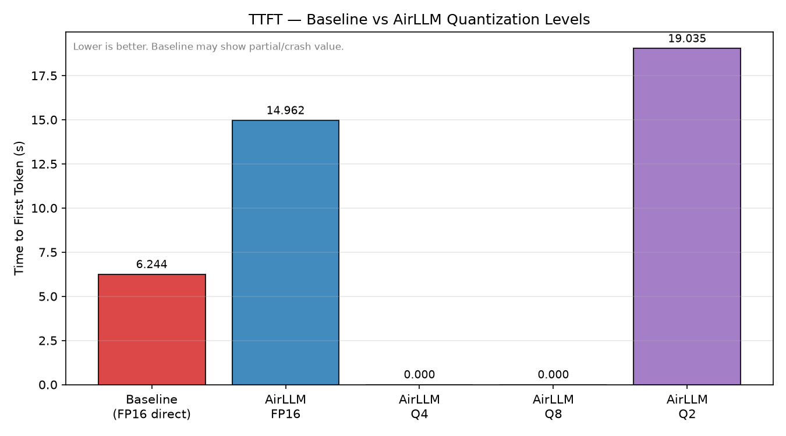
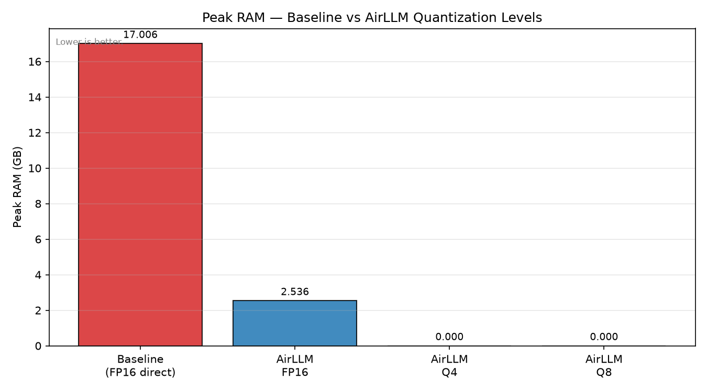
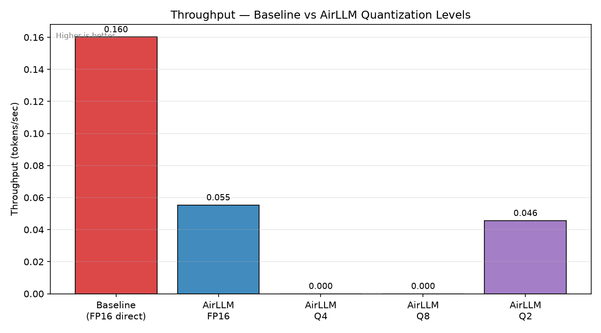
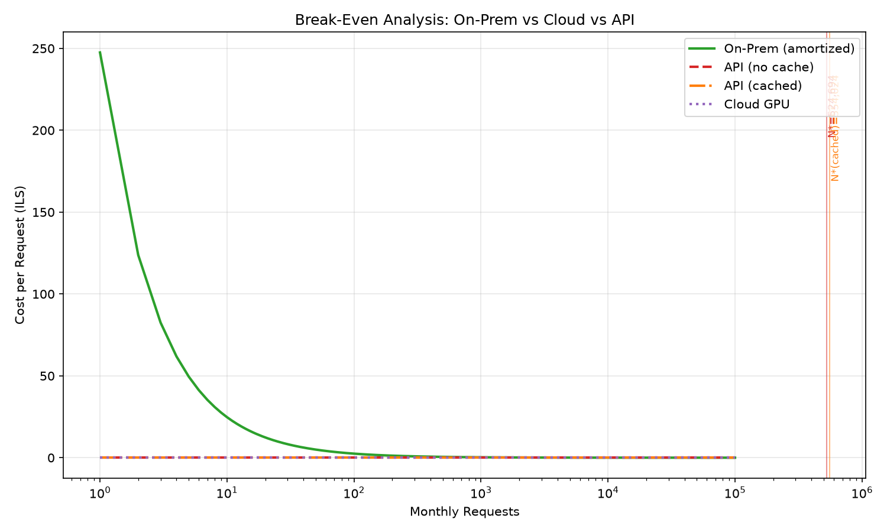

# EX05 — Running a Large LLM Locally with AirLLM and Quantization

> **Assignment:** EX05 | **Course:** [Course Name]
> **Authors:** [Your Name] & [Partner Name]

---

## Table of Contents

1. [Experiment Description](#1-experiment-description)
2. [Hardware Specifications](#2-hardware-specifications)
3. [Setup & Installation](#3-setup--installation)
4. [Execution Instructions](#4-execution-instructions)
5. [Results Summary](#5-results-summary)
6. [Figures](#6-figures)
7. [Economics Analysis](#7-economics-analysis)
8. [Discussion](#8-discussion)

---

## 1. Experiment Description

### Objective

This experiment explores whether a large language model (LLM) too large for a
laptop's RAM can be run locally using AirLLM's layer-by-layer streaming technique,
and how quantization affects the resulting latency, memory usage, throughput, and
estimated power consumption.

### Methodology

The experiment is divided into two stages:

**Stage 1 — Baseline (Direct FP16 Loading)**
We first attempt to load `meta-llama/Meta-Llama-3.1-8B-Instruct` using the
standard `transformers` pipeline with `torch_dtype=torch.float16` and
`device_map="cpu"`. At FP16 precision the model weights alone occupy ~16.1 GB,
which exceeds the available system RAM. We expect this stage to either crash with
an OOM error or be killed by a 600-second SIGALRM timeout. The resulting
`MetricsResult` (including error message and peak RAM at point of failure) is
saved to `results/baseline_<ts>.json` and included in comparison graphs as a
data point documenting the failure mode.

**Stage 2 — AirLLM Quantization Sweep**
We run the same model with AirLLM (`airllm.AutoModel`) across three quantization
levels in order of decreasing precision: FP16 (AirLLM mmap mode, expected to be
very slow), Q8 (8-bit), and Q4 (4-bit). For each level we:

1. Load the model with AirLLM, which streams transformer layers from disk one
   at a time — analogous to OS virtual memory paging but for model weights.
2. Measure **TTFT** (Time To First Token) via a dedicated single-token pass
   (`max_new_tokens=1`), isolating the Prefill compute phase.
3. Measure full generation throughput via a second pass (`max_new_tokens=200`).
4. Record **peak RAM** (RSS) using a background thread polling `psutil` at 0.5s
   intervals.
5. Compute **estimated power consumption** as
   `(total_runtime_seconds / 3600) × cpu_tdp_watts` where `cpu_tdp_watts` is
   read from `config/experiment_config.json`.
6. Save all KPIs to `results/airllm_<level>_<ts>.json`.

### Prompt

All stages use the identical prompt to ensure comparability:

> *"Explain the difference between supervised and unsupervised learning in three
> paragraphs."*

Token count: ~17 input tokens. Output capped at 200 tokens for throughput
measurement (10 tokens for the smoke test).

### Measurement Tools

| Metric | Implementation |
|---|---|
| TTFT | `InferenceTimer` context manager — records `t_first_token − t_start` |
| TPOT | Mean inter-token gap from `InferenceTimer.token_timestamps` |
| Throughput | `generated_tokens / total_runtime_seconds` |
| Peak RAM | `RamMonitor` (daemon thread, 0.5s polling via `psutil.Process.memory_info().rss`) |
| Power (est.) | `(runtime_sec / 3600) × cpu_tdp_watts` (TDP from config) |

### Quantization Rationale

| Level | Weight size (8B model) | Expectation |
|---|---|---|
| FP16 baseline | ~16.1 GB | OOM / timeout — documents the problem |
| AirLLM FP16 | ~16.1 GB (streamed) | Feasible but extremely slow (disk I/O) |
| Q8 | ~8.5 GB | Fits in RAM; moderate slowdown vs FP16 |
| Q4 | ~4.5 GB | Well within RAM; good throughput |

Q4 is our primary production candidate. Q8 shows the precision–speed trade-off.
FP16 (both direct and AirLLM) anchor the comparison as high-precision baselines.

---

## 2. Hardware Specifications


| Component | Specification |
|---|---|
| CPU | AMD Ryzen 9700x |
| GPU | AMD Radeon RX 9070XT 16GB |
| RAM | 32GB DDR5 |
| Storage | 512GB NVME PCIE 4.0 |
| OS | WINDOWS 11 PRO |
| CPU TDP | TBD W (update `config/experiment_config.json` → `cpu_tdp_watts`) |
| Hardware cost | TBD ILS (update `config/economics_config.json` → `hardware_cost_ils`) |

---

## 3. Setup & Installation

### Prerequisites

- Python 3.11 (exactly — not 3.12+)
- [`uv`](https://docs.astral.sh/uv/) installed globally
- A Hugging Face account with access to
  `meta-llama/Meta-Llama-3.1-8B-Instruct`

### Install

```bash
uv sync
```

### Configure environment

Copy `.env-example` to `.env` and insert your Hugging Face token:

```bash
cp .env-example .env
# edit .env and replace hf_YOUR_TOKEN_HERE with your real token
```

> **Never commit `.env` to Git.** It is already in `.gitignore`.

### Update hardware config (partner)

Edit `config/experiment_config.json` → set `cpu_tdp_watts` to your CPU's TDP.  
Edit `config/economics_config.json` → set `hardware_cost_ils` to the actual
cost of your hardware in ILS.

---

## 4. Execution Instructions

Run each script with `uv run python`. Scripts must be run from the **repository
root**.

### Step 0 — Verify environment (smoke test)

```bash
uv run python -c "from ex05.config import ExperimentConfig; print(ExperimentConfig.load())"
```

Expected: dataclass printed with no errors.

### Step 1 — Disk space check

Ensure ≥ 30 GB free before downloading the model:

```bash
df -h .          # Linux / macOS
# or check via File Explorer on Windows
```

### Step 2 — Stage 1: Baseline experiment

```bash
uv run python experiments/run_baseline.py
```

Expected output: OOM error or 10-minute timeout. A `results/baseline_*.json`
file is saved regardless of outcome. **Monitor RAM** — close all other
applications first.

### Step 3 — Stage 2: AirLLM quantization sweep

```bash
uv run python experiments/run_airllm.py
```

This iterates through all quantization levels defined in
`config/experiment_config.json` (`fp16`, `4bit`, `8bit` by default). Each level
takes 30–90 minutes depending on hardware and storage speed. Results are saved
to `results/airllm_<level>_<ts>.json`.

**Tips:**
- Close RAM-heavy applications before running.
- Keep ≥ 4 GB free RAM for Q4, ≥ 9 GB for Q8.
- Partial runs are fine — each level saves independently.

### Step 4 — Generate comparison graphs

```bash
uv run python experiments/generate_graphs.py
```

Reads all `results/*.json` files (excluding economics), produces three PNG
charts in `figures/`:

- `ttft_comparison.png` — Time to First Token per scenario
- `ram_comparison.png` — Peak RAM per scenario
- `throughput_comparison.png` — Throughput (tokens/sec) per scenario

### Step 5 — Economics analysis

```bash
uv run python experiments/run_economics.py
```

Produces `figures/break_even.png` (four cost curves + break-even annotations)
and `results/economics_<ts>.json`.

### Step 6 — Run tests

```bash
uv run pytest
```

Expected: ≥ 85% coverage on utility modules, all tests pass. Tests are fully
offline — no model download required.

---

## 5. Results Summary

> **[PLACEHOLDER — fill in after running experiments]**

| Scenario | TTFT (s) | TPOT (s/tok) | Throughput (tok/s) | Peak RAM (GB) | Power (Wh) | Error |
|---|---|---|---|---|---|---|
| Baseline FP16 | — | — | — | — | — | — |
| AirLLM FP16 | — | — | — | — | — | — |
| AirLLM Q8 | — | — | — | — | — | — |
| AirLLM Q4 | — | — | — | — | — | — |

---

## 6. Figures

> **[PLACEHOLDER — insert figures after running experiments]**

### TTFT Comparison



### Peak RAM Comparison



### Throughput Comparison



---

## 7. Economics Analysis

> **[PLACEHOLDER — fill in break-even numbers after running run_economics.py]**



| Metric | Value |
|---|---|
| On-Prem monthly fixed cost | — ILS |
| API cost/request (no cache) | — ILS |
| API cost/request (cached) | — ILS |
| Cloud GPU cost/request | — ILS |
| Break-even N* (no cache) | — requests/month |
| Break-even N* (cached) | — requests/month |

---

## 8. Discussion

> **[PLACEHOLDER — fill in after reviewing results (TODO R5-02 full analysis)]**

Answer the following questions in this section:

1. **Baseline bottleneck:** What caused the baseline failure? Was it a memory
   allocation error, a swap-induced slowdown, or a timeout? What does this tell
   us about the relationship between model size and available RAM?

2. **AirLLM and virtual memory paging:** How does AirLLM's layer-by-layer
   streaming relate to OS virtual memory paging? What are the analogies and
   differences?

3. **Effect of Q4/Q8 on memory and text quality:** How did quantization affect
   peak RAM? Did the generated text show quality degradation at Q4 vs Q8?
   Provide examples from the output.

4. **TTFT/TPOT and Prefill vs. Decode:** TTFT reflects the Prefill phase
   (compute-bound GEMM). TPOT reflects the Decode phase (memory/disk-bound
   GEMV). What did the measurements show? Did AirLLM's disk I/O dominate
   TPOT regardless of quantization level?

5. **Throughput / Latency trade-off:** Quantization reduces model size and
   thus disk I/O per layer, improving throughput. But does it improve latency
   (TTFT)? Explain the trade-off you observed.
